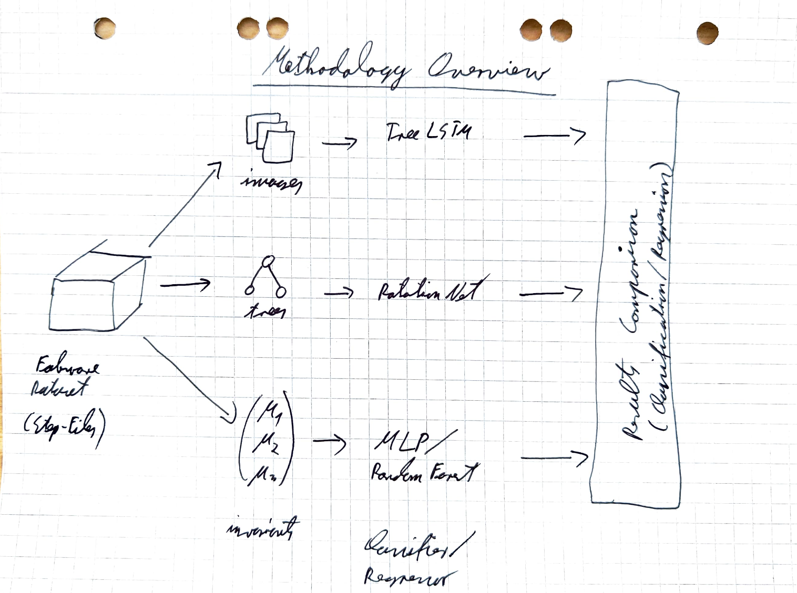

# Methodology

## Data Set

 We use the "FabWave" dataset (==reference==) for benchmarking our models. It provides a wide variaty of objects, but mainly mechanical components. It contains more than 4000 parts in step file format, belonging to 44 categories. 

Before appliying the data set to our models a thorough preprocessing had to be performed.

First, any empty or corrupted files are removed.

 
Unfortuantly not all parts form the dataset can be used for all three of our models. This is because not all step files could be converted into all three representaitons formats.For better comparison between the models we prepare a training, validation and test split of the data. Each ML model uses the same data splits. That means that the "FabWave" dataset has been filtered for STEP files for which all three representation types (invariants, images, graphs) can be generated.

The "FabWave" dataset categorizes the CAD models into 43 types of parts. These we use as given. For the regression task we determine we labels for each part grammatically. For each CAD model these regression labels are calculated. 

- Volume
- Amount of Faces, Edges and Vertices
- (Dimensions of the bounding box  ==Do we need to rotate all models according to their main distribution in space?==)

==summary table of the final dataset==

## Representation of CAD data

## Machine Learning Models

### Tree-LSTM for trees representaiton

### RotationNet for image representation

### MLP for Invariants
Our models are tested with a classification tasks, as well as a multi-regression task. The classification task aims at the identification of the *type* a given part is categorized as; e.g. gears, bearing, etc. The regression tasks is set up to determine several basic attributes of a CAD model, like its volume, its amount of vertices, edges and faces, and bounding box dimensions.

### Model Training

For each ML model a hyperparameter tuning is performed; followed by a final training session of the tuned ML model.  Only by optimizing all ML models fair and meaningful comparisons can be drawn.

ML Models

Three different machine learning models are compared. The models have been chosen, because they state different approaches in anlysising CAD models. The central difference between these approaches is the *representation* of the CAD models information. It is hypothesised that not all representations are able to convey the same amount of information yielding in different performances for the models. The models themselfs have merely been chosen as they are capable of processing the coressponding CAD model representations.

To allow for a good comparability all models are trained on the same data set. Note that it would be also reasonable to use different preprocessing techniques like data augmentation for each approach, without changing the comparability. But in order to support the argument that one representation type can generally be expected to yield better results than another, we use the same preprocessing for all models.

## Comparision of Representation approaches

We compare the three different representation types in terms of their performance in a classification and a regression task.
Since we aim to identify the representation type most suitable for a general understanding of CAD models, we setup both tasks to be as general as possible.
That is we sticked to universal model properties as prediction targets as much as possible.
For this reason the regression task aims to predict the volume and amount of faces, edges and vertices of a CAD model.
For the classification task we used the part categories given in the "FabWave" dataset.

For each task we compare the performance of the three models in terms of multiple metrics. For the regression task this includes the mean absolute error (MAE) and the root mean square error (RMSE). We also report on the error distrubution (MAE) ==fact check== for each prediction target for each model.
For the classification task we assess model performance in terms of accuracy, precision, recall and F1-score.
